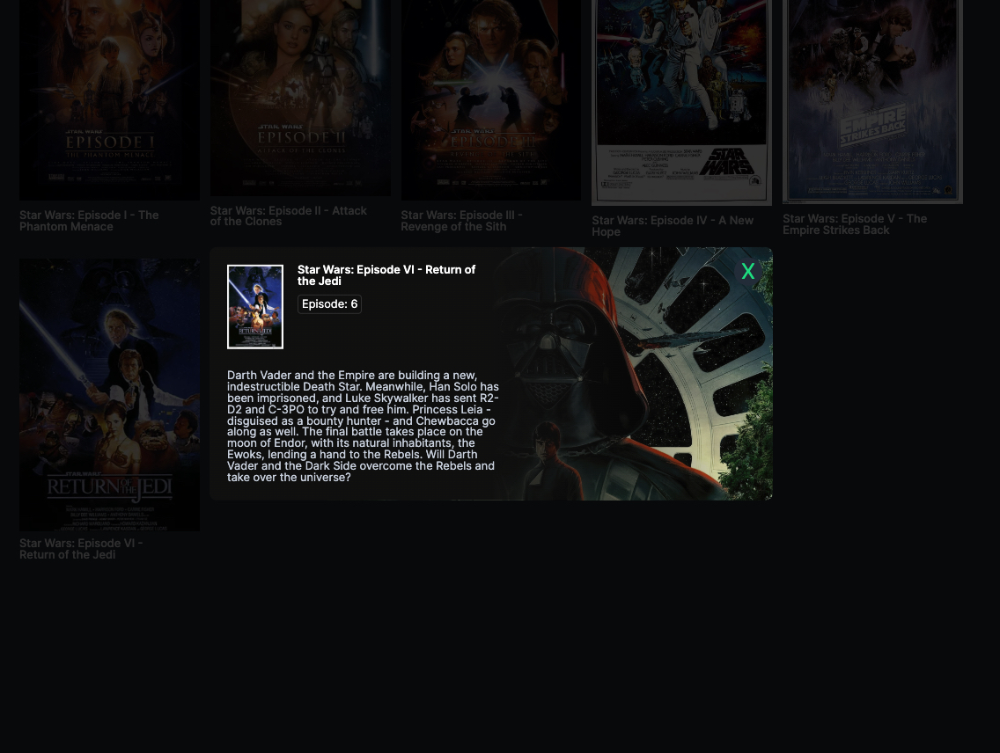
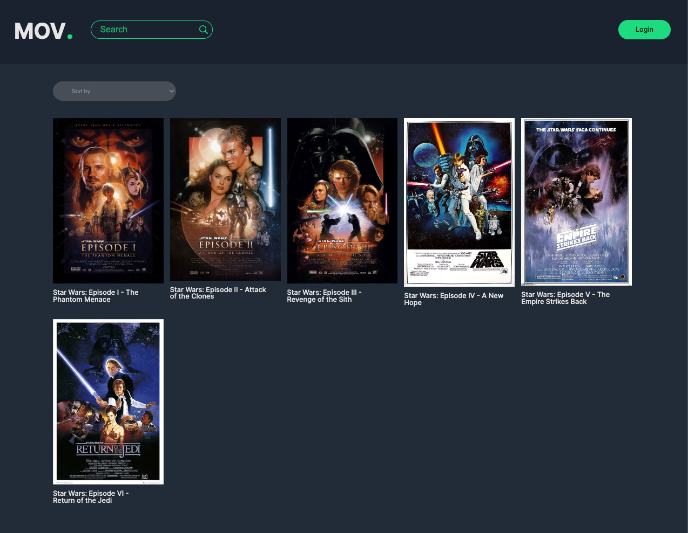

# React Movie App

The React Movie App is a web application that allows users to browse and search for movies. It displays a list of movies along with their details, such as title, poster image, and description. Users can also log in and log out of the app.

<div style="display: flex;">
  
  
</div>

## Features

- Fetch movies from API
- Browse and search movies
- Search movies by main character
- Sort movies by episode number
- View movie details in a modal
- Toggle user login/logout

## Technologies Used

- React
- Vite
- JavaScript
- SCSS

## Prerequisites

- Node.js (v12 or higher) installed on your local machine

## Getting Started

1. Clone the repository:

   ```bash
   git clone https://github.com/your-username/react-movie-app.git

2. Navigate to the project directory:

   ```bash
   cd react-movie-app

3. Install the dependencies:

   ```bash
   npm install

4. Start the development server:

   ```bash
   npm run dev

## Usage
- To search for movies, enter a search query in the search bar and press Enter or click the search button. The search will match against movie titles and main characters.
- If you enter a search query that matches a movie title or any main character's name, the corresponding movies will be displayed.
- You can also search specifically for movies featuring a particular main character by entering the character's name. For example, typing "Luke Skywalker" will filter the movies to show only those in which Luke Skywalker appears.
- To sort the movies, select an option from the "Sort by" dropdown menu.
- Click on a movie to view its details in a modal.
- Please note that there is no actual login and logout system with authorization in place. The purpose of this button is to showcase how the button would appear and how the userLoggedIn state would change if such a system were implemented. Currently, the userLoggedIn state is set to false by default and will switch to true when the button is clicked. This feature serves as a demonstration and does not have any functional authentication or authorization mechanisms implemented.


